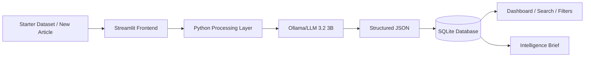

# ASTRA SENTINEL

AI-Powered Defence Information Monitoring System — ASTRA Software Team 3-Day Build Challenge 2026–27.

## Overview
SENTINEL converts a collection of public articles into structured intelligence. Articles are stored in SQLite and can be categorized, summarized and enriched with keywords, topics and entities using an LLM. The dashboard supports search and filtering, while the Intelligence Brief page answers collection-level questions.

## Features
- ASTRA starter dataset ingestion
- AI categorization into the challenge categories
- AI-generated concise summaries
- Keyword/topic/entity extraction
- SQLite persistence
- Search and category/date filtering
- Add-article UI
- Error handling for empty/malformed inputs
- Collection-level Intelligence Brief

## Tech Stack
- Python
- Streamlit
- SQLite
- Ollama
- Llama 3.2 3B
- Pandas
- Plotly (available for future analytics)

## Architecture


## Setup
```bash
python -m venv .venv
# Windows PowerShell
.venv\Scripts\Activate.ps1
pip install -r requirements.txt
```


Replace it with:

```markdown
Install Ollama and make sure the model is available:

```bash
ollama pull llama3.2:3b
```

Run:
```bash
streamlit run app.py
```

## Dataset
The project uses the ASTRA-provided `articles.jsonl` starter dataset. No scraping is required.

## Testing
Test empty article input, malformed JSON lines, missing API key, successful AI processing, search, category/date filtering, database persistence and Intelligence Brief generation.

## Limitations
- AI output depends on model availability and API quality.
- The starter application does not perform live web scraping.
- Search is lexical rather than embedding-based semantic search.
- Intelligence Brief retrieval currently uses processed article summaries.

## Future Improvements
- Embedding-based similarity search
- Duplicate detection
- Trend/timeline analytics
- Article clustering
- Source reliability metadata
- Retrieval-augmented generation with citations

## AI Usage Disclosure
AI tools were used for coding assistance, debugging and documentation. Generated code was reviewed, modified and tested before inclusion. The application uses a locally hosted Llama 3.2 3B model through Ollama for article categorization, summarization and enrichment. This avoids requiring external API credits during normal operation.